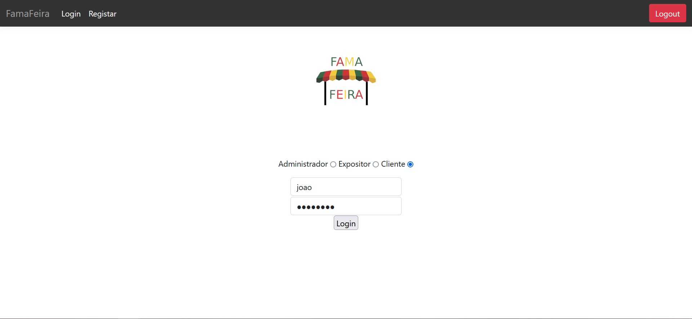
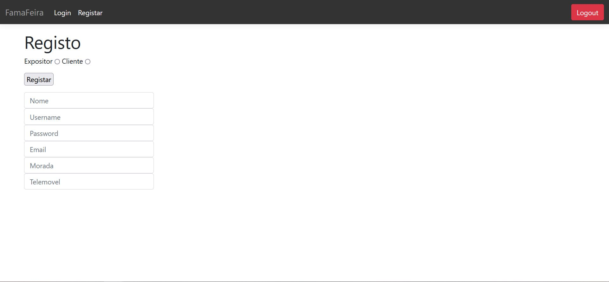
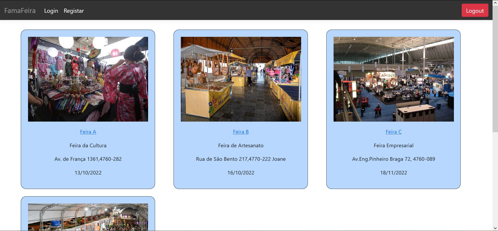
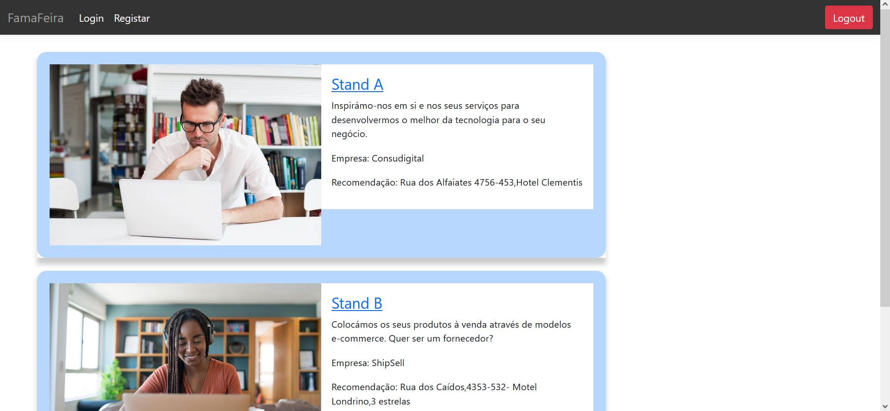
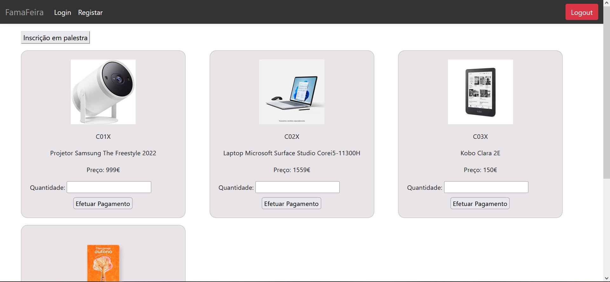

# FAMAFEIRA-LI4

## Contextualização

Em 1986 foi proposta uma definição de feira por Black R., que se revela consensual até aos dias de hoje. Este define feiras e exposições como um “evento que reúne num único local grupos de produtores, fornecedores, distribuidores e afins, para uma exposição física dos produtos e serviços com vista à demonstração dos mesmos junto dos visitantes (clientes ou potenciais clientes)”.
As feiras envolvem essencialmente 4 entidades: a Câmara, que controla e gere os espaços e a realização das feiras do município; a Empresa, que é representada por um Expositor; o Expositor que vende os produtos e serviços propostos pela Empresa e, por fim, o Cliente, que interage com os expositores e entra em contacto com os seus produtos/serviços.

A origem da feira em Famalicão remonta aos tempos do rei D. Sancho I, em que através de uma carta foral ordenou que a povoação realizasse uma feira quinzenal, tradição esta que foi mantida até aos dias de hoje e que é seguida semanalmente.
O município de Vila Nova de Famalicão, ao longo dos anos tem vindo a ser cada vez mais reconhecido como um dos principais centros culturais, comerciais e industriais a nível nacional. Atualmente, revela-se como o município mais exportador da região Norte, nos setores têxtil e vestuário. 
Em Famalicão são organizadas anualmente vários tipos de feiras, nomeadamente, feiras de empreendedorismo, feiras de negócios, culturais, entre outras…
Neste momento, Famalicão conta com uma rede de 6 parques empresariais das mais diversas características, em que todas estas redes estão orientadas para providenciar a atividade empresarial. Estes parques fazem parte de um investimento feito pela Câmara a cargo do projeto “Made IN”, em que procura valorizar e promover a genética empreendedora do município, captar novos investimentos e auxiliar os empresários famalicenses a promoverem e desenvolverem os seus projetos empresariais.
As feiras de empreendedorismo são uma oportunidade para os expositores destas empresas apresentarem as suas ideias e serviços, de forma a encontrarem novos clientes que pretendam adquirir os seus produtos. 
A maioria destas empresas entraram recentemente para o mercado. Entre estas organizações existe a Digitrine, cujo CEO é a Sra. Glória Vaz. Esta empresa presta consultoria através de plataformas digitais. Um exemplo desses mesmos serviços é o DinnerPlate , que é uma app em que as pessoas podem consultar e seguir as sugestões diárias dos seus restaurantes favoritos. A sra. Glória é uma pessoa muito determinada e que gosta de ajudar o próximo. No entanto, encontra-se um pouco frustrada pelo facto da adesão das pessoas não estar a corresponder às suas expectativas.
 Benício Melo, Presidente da Câmara, é uma pessoa ambiciosa e lutadora, que nasceu e cresceu em Famalicão. O Sr. Melo tem a responsabilidade de gerir a terra que ele tanto ama, lutar pelos interesses dos seus habitantes e solucionar eventuais problemas. Portanto, este pretende que o município prospere a nível económico e que tenha uma dimensão elevada a nível nacional.

## Apresentação do Caso de Estudo

A iniciativa “Made IN” é um projeto real proposto pela Câmara Municipal de Vila Nova de Famalicão que visa a atividade empreendedora das jovens empresas famalicenses através da realização de feiras como forma de promoção das suas ideias. Deste modo, socorremo-nos desta proposta para desenvolvermos um caso de estudo que pudesse suportar o nosso trabalho do desenvolvimento de um sistema de feiras online.
Este será um caso de estudo que será desenvolvido de forma incremental e que terá em conta os vários requisitos levantados em conjunto com as entidades envolvidas.

## Fundamentação

A nossa equipa de projeto deslocou-se até uma destas feiras anuais de empreendedorismo. De forma a elaborar hipóteses que justificassem a menor afluência de pessoas a estas feiras, realizámos uma entrevista com o senhor Raimundo.
Nestas feiras apercebemo-nos de uma clara ausência de planeamento. Grande parte dos expositores não possuíam uma estratégia bem definida de marketing ou não tinham um mecanismo de registo dos clientes e fornecedores, o que é prejudicial caso estes pretendam estabelecer um contacto futuro com eles para publicitar os seus novos serviços. Uma outra hipótese levantada foi a pouca disponibilidade das pessoas de se dirigirem até um destes locais de evento, ora pela grande distância da sua área de residência ou pelo desconhecimento do local.
 Após conversações efetuadas com as empresas e a Câmara, decidiu-se implementar um sistema que visasse solucionar esses problemas. Esta aplicação será uma ótima ferramenta para complementar os rendimentos dos feirantes, visto que será um meio de propagação do nome das empresas e do trabalho que estas realizam. Por outro lado, esta será uma plataforma em que os feirantes terão acesso às informações dos possíveis fornecedores, o que é relevante quando se possui um negócio pois estabelecer contactos faz parte de uma boa estratégia de comercialização. Por fim, a FamaFeira irá possibilitar uma maior acessibilidade dos consumidores aos produtos, sem a necessidade de se deslocarem aos locais de evento. Em feiras de carácter expositivo, os clientes poderão assegurar a sua presença em palestras e obter recomendações de estadia. Desta forma, a aplicação irá promover a economia local, atraindo não só investidores e fornecedores, mas também turistas.
	
## Motivação e Objetivos

Face aos problemas identificados na secção anterior, propomo-nos a desenvolver um software que procure promover online os serviços prestados por estas empresas. Esta aplicação irá conter vários tipos de feiras: gastronómicas, culturas, artesanais, etc. Por outro lado, esta aplicação irá permitir que pessoas que não tenham a possibilidade de se deslocar até estes recintos, possam efetuar as suas compras através do sistema FamaFeira. Em feiras de cariz expositivo os clientes poderão fazer a sua inscrição em palestras. Devido ao facto da maioria das pessoas não residirem na área de evento, a aplicação também irá sugerir locais de alojamento neste tipo de feiras.
 Deste modo, a aplicação será uma ferramenta de promoção das várias empresas famalicenses, o que irá contribuir para a economia local do município, já que esta irá atrair investidores e turistas. Numa outra perspetiva, este sistema será útil para a Câmara, já que esta poderá ter um maior controlo sobre as organizações e do espaço que estas usufruem nestes eventos.

## Viabilidade

De forma a avaliar a viabilidade deste projeto, a nossa equipa de desenvolvimento reuniu-se com analistas, membros da Câmara e com CEO’s de algumas empresas para discutir os custos que a implementação de um sistema deste tipo acarretaria, assim como os lucros que irão advir deste investimento. Após a realização de vários inquéritos online direcionadas às empresas prevê-se uma adesão de mais de 90% à aplicação. A maioria destas justifica esta adesão devido ao proveito monetário que estas terão com eventuais compras realizadas por parte dos clientes, e, por outro lado, será uma ótima forma de propagarem a marca da empresa.
Ficou acordado que a divisão dos custos da implementação deste software será de 40% para as organizações e 60% para a câmara, uma vez que estas empresas não possuem a mesma capacidade financeira que este órgão executivo. Estes 40% fazem parte de uma taxa que as empresas irão pagar devido à adesão à plataforma. Assim, antevê-se que num espaço temporal mínimo de 3 meses as receitas resultantes das visitas à aplicação irão encobrir o investimento total das empresas. Esta receita irá ser resultante, essencialmente, dos cliques nos anúncios presentes no website, assim como das compras online de cada uma das organizações. Os restantes 60% serão prontamente pagos numa primeira prestação através dos 25% do valor das receitas provenientes das rendas cobradas aos feirantes no ano de 2021. 
A adesão de várias pessoas à plataforma irá promover o município famalicense e despertar a curiosidade das mesmas em visitar as várias atrações locais de Famalicão, e além disso potenciar estas empresas a dar o salto que necessitam. Consequentemente, isto irá permitir melhorar a economia e arrecadar mais receitas pelos serviços que esta presta aos seus visitantes e habitantes. Estima-se que a médio-longo prazo este projeto irá melhorar a economia famalicense em cerca de 3.7% do PIB do município.
De notar que o sucesso da aplicação estará dependente da frequência com que os dados dos produtos e feiras são atualizados na base de dados, atualizações estas que têm de ser asseguradas pelos feirantes e pela Câmara Municipal.

## Autenticação

## Catálogo de Feiras

## Catálogo de Stands

## Catálogo de Produtos

